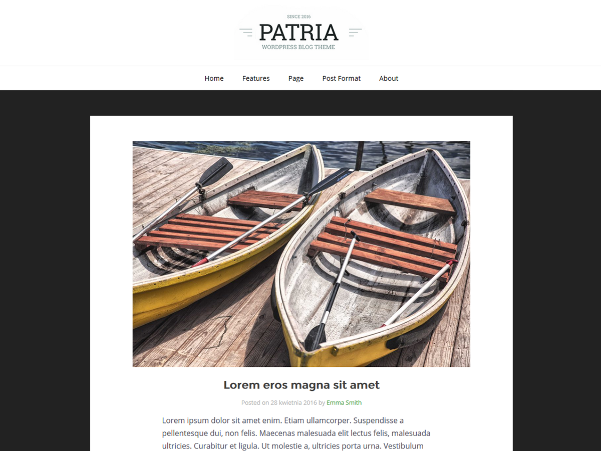

# Patria
Patria is a minimalist, simple and creative Wordpress blog theme. This theme is content-focused, so it is perfect for a personal blog. It supports 7 Post Formats (standard, gallery, image, audio, video, quote, link). It is simple and elegant. Theme options are directly incorporated with WordPress. Patria is suitable for any kind of personal or hobby blog.

## Demo 
Demonstration version you can see on [Patria website](http://patria.karolprofic.pl/)

## Credits
Without these projects, this WordPress Theme wouldn't be where it is today.
##### Reset CSS
   * Copyright  (C) 2007 by Eric Meyer
   * Author:    Eric Meyer
   * License:   none (public domain)
   * Homepage:  https://meyerweb.com/

##### Font Awesome
   * Copyright  (C) 2012 by Dave Gandy
   * Author:    Dave Gandy
   * License:   [SIL](http://scripts.sil.org/OFL)
   * Homepage:  http://fortawesome.github.com/Font-Awesome/

##### Web Symbols
   * Copyright  (c) 2011 by Just Be Nice studio. All rights reserved.
   * Author:    Just Be Nice studio
   * License:   [SIL](http://scripts.sil.org/OFL)
   * Homepage:  http://www.justbenicestudio.com/

##### Entypo
   * Copyright  (C) 2012 by Daniel Bruce
   * Author:    Daniel Bruce
   * License:   [SIL](http://scripts.sil.org/OFL)
   * Homepage:  http://www.entypo.com

##### Elusive
   * Copyright  (C) 2013 by Aristeides Stathopoulos
   * Author:    Aristeides Stathopoulos
   * License:   [SIL](http://scripts.sil.org/OFL)
   * Homepage:  http://aristeides.com/

##### Open Sans
   * Copyright  (C) 2010 by Steve Matteson
   * Author:    Steve Matteson
   * License:   [ Apache License, Version 2.0](https://www.apache.org/licenses/LICENSE-2.0)
   * Homepage:  http://www.monotype.com/

##### Montserrat 
   * Copyright  (C) 2011 by Julieta Ulanovsky
   * Author:    Julieta Ulanovsky
   * License:   [Open Font License](http://scripts.sil.org/cms/scripts/page.php?site_id=nrsi&id=OFL_web)
   * Homepage:  http://montserrat.zkysky.com.ar/en